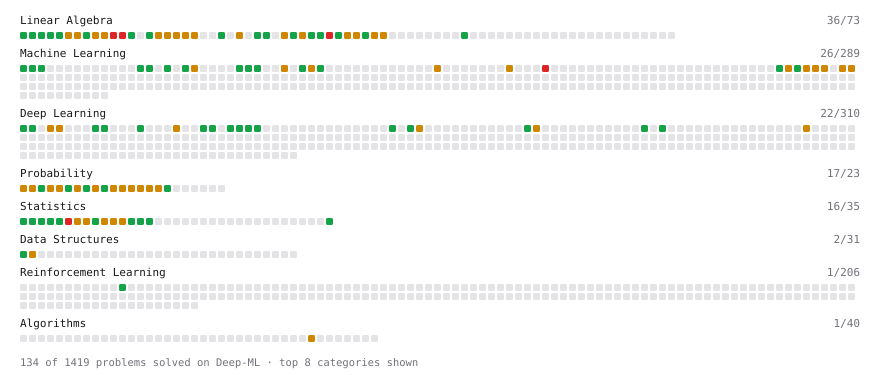

# Deep-ML

My machine learning practice from [Deep-ML](https://www.deep-ml.com). Every solution here was written by hand.

**Completed:** Calculus (9/9)

**125** solved · 117 problems · 5 labs · 3 math

[**Browse the interactive portfolio**](https://sanjanabhat2103.github.io/deep-ml/) to replay this filling in over time.

## Problems

| | Difficulty | Solved | |
| --- | --- | --- | --- |
| [Adamax Optimizer](https://www.deep-ml.com/problems/148) | easy | 2026-09-17 | [solution](problems/0148-adamax-optimizer) |
| [Bhattacharyya Distance Between Two Distributions](https://www.deep-ml.com/problems/120) | easy | 2026-07-28 | [solution](problems/0120-bhattacharyya-distance-between-two-distributions) |
| [Calculate 2x2 Matrix Inverse](https://www.deep-ml.com/problems/8) | easy | 2026-07-25 | [solution](problems/0008-calculate-2x2-matrix-inverse) |
| [Calculate Accuracy Score](https://www.deep-ml.com/problems/36) | easy | 2026-07-29 | [solution](problems/0036-calculate-accuracy-score) |
| [Calculate Conditional Probability from Data](https://www.deep-ml.com/problems/168) | easy | 2026-07-30 | [solution](problems/0168-calculate-conditional-probability-from-data) |
| [Calculate Cosine Similarity Between Vectors](https://www.deep-ml.com/problems/76) | easy | 2026-07-29 | [solution](problems/0076-calculate-cosine-similarity-between-vectors) |
| [Calculate Covariance Matrix](https://www.deep-ml.com/problems/10) | easy | 2026-07-25 | [solution](problems/0010-calculate-covariance-matrix) |
| [Calculate Mean by Row or Column](https://www.deep-ml.com/problems/4) | easy | 2026-07-24 | [solution](problems/0004-calculate-mean-by-row-or-column) |
| [Calculate P50/P95/P99 Latency Percentiles](https://www.deep-ml.com/problems/293) | easy | 2026-07-30 | [solution](problems/0293-calculate-p50-p95-p99-latency-percentiles) |
| [Calculate the Phi Coefficient](https://www.deep-ml.com/problems/95) | easy | 2026-07-28 | [solution](problems/0095-calculate-the-phi-coefficient) |
| [Check Linear Independence of Vectors](https://www.deep-ml.com/problems/331) | easy | 2026-07-29 | [solution](problems/0331-check-linear-independence-of-vectors) |
| [Compute Discounted Return](https://www.deep-ml.com/problems/165) | easy | 2026-09-17 | [solution](problems/0165-compute-discounted-return) |
| [Compute Posterior Probability using Bayes' Theorem](https://www.deep-ml.com/problems/336) | easy | 2026-07-30 | [solution](problems/0336-compute-posterior-probability-using-bayes-theorem) |
| [Compute the Cross Product of Two 3D Vectors](https://www.deep-ml.com/problems/118) | easy | 2026-07-29 | [solution](problems/0118-compute-the-cross-product-of-two-3d-vectors) |
| [Convert Vector to Diagonal Matrix](https://www.deep-ml.com/problems/35) | easy | 2026-07-29 | [solution](problems/0035-convert-vector-to-diagonal-matrix) |
| [Demonstrate Law of Large Numbers with Sampling](https://www.deep-ml.com/problems/342) | easy | 2026-07-28 | [solution](problems/0342-demonstrate-law-of-large-numbers-with-sampling) |
| [Derivative of a Polynomial](https://www.deep-ml.com/problems/116) | easy | 2026-07-25 | [solution](problems/0116-derivative-of-a-polynomial) |
| [Derivatives of Activation Functions](https://www.deep-ml.com/problems/217) | easy | 2026-07-26 | [solution](problems/0217-derivatives-of-activation-functions) |
| [Descriptive Statistics Calculator](https://www.deep-ml.com/problems/78) | easy | 2026-07-28 | [solution](problems/0078-descriptive-statistics-calculator) |
| [Dot Product Calculator](https://www.deep-ml.com/problems/83) | easy | 2026-07-29 | [solution](problems/0083-dot-product-calculator) |
| [Empirical Probability Mass Function (PMF)](https://www.deep-ml.com/problems/184) | easy | 2026-07-28 | [solution](problems/0184-empirical-probability-mass-function-pmf) |
| [Expected Value and Variance of an n-Sided Die](https://www.deep-ml.com/problems/179) | easy | 2026-07-29 | [solution](problems/0179-expected-value-and-variance-of-an-n-sided-die) |
| [Exponential Distribution PDF and CDF](https://www.deep-ml.com/problems/340) | easy | 2026-07-28 | [solution](problems/0340-exponential-distribution-pdf-and-cdf) |
| [Feature Scaling Implementation](https://www.deep-ml.com/problems/16) | easy | 2026-08-03 | [solution](problems/0016-feature-scaling-implementation) |
| [Generate Normal Samples and Compute Histogram Counts](https://www.deep-ml.com/problems/1130) | easy | 2026-07-28 | [solution](problems/1130-generate-normal-samples-and-compute-histogram-counts) |
| [Gradient Direction and Magnitude](https://www.deep-ml.com/problems/308) | easy | 2026-07-26 | [solution](problems/0308-gradient-direction-and-magnitude) |
| [Implement Orthogonal Projection of a Vector onto a Line](https://www.deep-ml.com/problems/66) | easy | 2026-07-29 | [solution](problems/0066-implement-orthogonal-projection-of-a-vector-onto-a-line) |
| [Implement Precision Metric](https://www.deep-ml.com/problems/46) | easy | 2026-08-04 | [solution](problems/0046-implement-precision-metric) |
| [Implement ReLU Activation Function](https://www.deep-ml.com/problems/42) | easy | 2026-08-04 | [solution](problems/0042-implement-relu-activation-function) |
| [KL Divergence Between Two Normal Distributions](https://www.deep-ml.com/problems/56) | easy | 2026-07-31 | [solution](problems/0056-kl-divergence-between-two-normal-distributions) |
| [Leaky ReLU Activation Function](https://www.deep-ml.com/problems/44) | easy | 2026-08-04 | [solution](problems/0044-leaky-relu-activation-function) |
| [Linear Regression Using Gradient Descent](https://www.deep-ml.com/problems/15) | easy | 2026-07-27 | [solution](problems/0015-linear-regression-using-gradient-descent) |
| [Linear Regression Using Normal Equation](https://www.deep-ml.com/problems/14) | easy | 2026-07-27 | [solution](problems/0014-linear-regression-using-normal-equation) |
| [Matrix Determinant & Trace](https://www.deep-ml.com/problems/195) | easy | 2026-07-29 | [solution](problems/0195-matrix-determinant-trace) |
| [Matrix-Vector Dot Product](https://www.deep-ml.com/problems/1) | easy | 2026-07-24 | [solution](problems/0001-matrix-vector-dot-product) |
| [Min-Max Scaling of Feature Values](https://www.deep-ml.com/problems/112) | easy | 2026-07-29 | [solution](problems/0112-min-max-scaling-of-feature-values) |
| [Momentum Optimizer](https://www.deep-ml.com/problems/146) | easy | 2026-07-27 | [solution](problems/0146-momentum-optimizer) |
| [One-Hot Encoding of Nominal Values](https://www.deep-ml.com/problems/34) | easy | 2026-08-03 | [solution](problems/0034-one-hot-encoding-of-nominal-values) |
| [Permutation Test for a Difference in Means](https://www.deep-ml.com/problems/1426) | easy | 2026-09-17 | [solution](problems/1426-permutation-test-for-a-difference-in-means) |
| [Poisson Distribution Probability Calculator](https://www.deep-ml.com/problems/81) | easy | 2026-07-29 | [solution](problems/0081-poisson-distribution-probability-calculator) |
| [Reshape Matrix](https://www.deep-ml.com/problems/3) | easy | 2026-07-24 | [solution](problems/0003-reshape-matrix) |
| [Row-Normalize a Count Matrix to Probabilities](https://www.deep-ml.com/problems/985) | easy | 2026-07-29 | [solution](problems/0985-row-normalize-a-count-matrix-to-probabilities) |
| [Sampling Distribution of the Mean](https://www.deep-ml.com/problems/181) | easy | 2026-07-30 | [solution](problems/0181-sampling-distribution-of-the-mean) |
| [Scalar Multiplication of a Matrix](https://www.deep-ml.com/problems/5) | easy | 2026-07-24 | [solution](problems/0005-scalar-multiplication-of-a-matrix) |
| [Sigmoid Activation Function Understanding](https://www.deep-ml.com/problems/22) | easy | 2026-07-27 | [solution](problems/0022-sigmoid-activation-function-understanding) |
| [Softmax Activation Function Implementation ](https://www.deep-ml.com/problems/23) | easy | 2026-08-04 | [solution](problems/0023-softmax-activation-function-implementation) |
| [Taylor Series Approximation](https://www.deep-ml.com/problems/310) | easy | 2026-07-27 | [solution](problems/0310-taylor-series-approximation) |
| [Transformation Matrix from Basis B to C](https://www.deep-ml.com/problems/27) | easy | 2026-07-29 | [solution](problems/0027-transformation-matrix-from-basis-b-to-c) |
| [Transpose of a Matrix](https://www.deep-ml.com/problems/2) | easy | 2026-07-24 | [solution](problems/0002-transpose-of-a-matrix) |
| [Vector Element-wise Sum](https://www.deep-ml.com/problems/121) | easy | 2026-07-29 | [solution](problems/0121-vector-element-wise-sum) |
| [Vector Norms (L1/L2/L-inf) and the Frobenius Norm](https://www.deep-ml.com/problems/328) | easy | 2026-07-29 | [solution](problems/0328-vector-norms-l1-l2-l-inf-and-the-frobenius-norm) |
| [Adadelta Optimizer](https://www.deep-ml.com/problems/149) | medium | 2026-09-17 | [solution](problems/0149-adadelta-optimizer) |
| [Adam Optimizer](https://www.deep-ml.com/problems/87) | medium | 2026-09-17 | [solution](problems/0087-adam-optimizer) |
| [Bayesian Inference for Beta-Binomial Model](https://www.deep-ml.com/problems/213) | medium | 2026-08-03 | [solution](problems/0213-bayesian-inference-for-beta-binomial-model) |
| [Beta Distribution PDF and Statistics](https://www.deep-ml.com/problems/339) | medium | 2026-07-28 | [solution](problems/0339-beta-distribution-pdf-and-statistics) |
| [Binary Search for Value or Closest Index](https://www.deep-ml.com/problems/1216) | medium | 2026-09-17 | [solution](problems/1216-binary-search-for-value-or-closest-index) |
| [Binomial Distribution Probability](https://www.deep-ml.com/problems/79) | medium | 2026-07-29 | [solution](problems/0079-binomial-distribution-probability) |
| [Birthday Problem Probability](https://www.deep-ml.com/problems/246) | medium | 2026-07-29 | [solution](problems/0246-birthday-problem-probability) |
| [Calculate Correlation Matrix](https://www.deep-ml.com/problems/37) | medium | 2026-07-29 | [solution](problems/0037-calculate-correlation-matrix) |
| [Calculate Eigenvalues of a Matrix](https://www.deep-ml.com/problems/6) | medium | 2026-07-24 | [solution](problems/0006-calculate-eigenvalues-of-a-matrix) |
| [Calculate KL Divergence Between Two Multivariate Gaussian Distributions](https://www.deep-ml.com/problems/136) | medium | 2026-07-31 | [solution](problems/0136-calculate-kl-divergence-between-two-multivariate-gaussian-distributions) |
| [Calculate Statistical Power for Experiment Design](https://www.deep-ml.com/problems/296) | medium | 2026-08-02 | [solution](problems/0296-calculate-statistical-power-for-experiment-design) |
| [Central Limit Theorem Simulation](https://www.deep-ml.com/problems/182) | medium | 2026-07-30 | [solution](problems/0182-central-limit-theorem-simulation) |
| [Chain Rule for Composite Functions](https://www.deep-ml.com/problems/214) | medium | 2026-07-26 | [solution](problems/0214-chain-rule-for-composite-functions) |
| [Check if Matrix is Positive Definite](https://www.deep-ml.com/problems/332) | medium | 2026-07-29 | [solution](problems/0332-check-if-matrix-is-positive-definite) |
| [Chi-square Probability Distribution](https://www.deep-ml.com/problems/176) | medium | 2026-07-30 | [solution](problems/0176-chi-square-probability-distribution) |
| [Classify Critical Points Using Hessian Eigenvalues](https://www.deep-ml.com/problems/311) | medium | 2026-07-27 | [solution](problems/0311-classify-critical-points-using-hessian-eigenvalues) |
| [Compute Covariance from Joint Probability Mass Function](https://www.deep-ml.com/problems/243) | medium | 2026-07-30 | [solution](problems/0243-compute-covariance-from-joint-probability-mass-function) |
| [Compute Orthonormal Basis for 2D Vectors](https://www.deep-ml.com/problems/117) | medium | 2026-07-29 | [solution](problems/0117-compute-orthonormal-basis-for-2d-vectors) |
| [Compute the Hessian Matrix](https://www.deep-ml.com/problems/218) | medium | 2026-07-26 | [solution](problems/0218-compute-the-hessian-matrix) |
| [Compute the Null Space (Kernel) of a Matrix](https://www.deep-ml.com/problems/330) | medium | 2026-07-29 | [solution](problems/0330-compute-the-null-space-kernel-of-a-matrix) |
| [Compute Total Probability using Law of Total Probability](https://www.deep-ml.com/problems/244) | medium | 2026-07-30 | [solution](problems/0244-compute-total-probability-using-law-of-total-probability) |
| [Conditional Probability from Joint Distribution](https://www.deep-ml.com/problems/180) | medium | 2026-07-30 | [solution](problems/0180-conditional-probability-from-joint-distribution) |
| [Confidence Interval for Population Mean](https://www.deep-ml.com/problems/212) | medium | 2026-08-02 | [solution](problems/0212-confidence-interval-for-population-mean) |
| [Derivative of Cross-Entropy Loss w.r.t. Logits](https://www.deep-ml.com/problems/220) | medium | 2026-07-26 | [solution](problems/0220-derivative-of-cross-entropy-loss-w-r-t-logits) |
| [Derivative of Softmax](https://www.deep-ml.com/problems/219) | medium | 2026-07-26 | [solution](problems/0219-derivative-of-softmax) |
| [Engram Context-Aware Gating](https://www.deep-ml.com/problems/327) | medium | 2026-07-29 | [solution](problems/0327-engram-context-aware-gating) |
| [Entropy & Cross-Entropy](https://www.deep-ml.com/problems/205) | medium | 2026-07-30 | [solution](problems/0205-entropy-cross-entropy) |
| [Find Captain Redbeard's Hidden Treasure](https://www.deep-ml.com/problems/127) | medium | 2026-07-27 | [solution](problems/0127-find-captain-redbeard-s-hidden-treasure) |
| [Gauss-Seidel Method for Solving Linear Systems](https://www.deep-ml.com/problems/57) | medium | 2026-07-29 | [solution](problems/0057-gauss-seidel-method-for-solving-linear-systems) |
| [Gaussian Elimination for Solving Linear Systems](https://www.deep-ml.com/problems/58) | medium | 2026-07-29 | [solution](problems/0058-gaussian-elimination-for-solving-linear-systems) |
| [Gaussian Mixture Model with EM Algorithm](https://www.deep-ml.com/problems/341) | medium | 2026-08-03 | [solution](problems/0341-gaussian-mixture-model-with-em-algorithm) |
| [Gradient Clipping by Global Norm](https://www.deep-ml.com/problems/197) | medium | 2026-09-17 | [solution](problems/0197-gradient-clipping-by-global-norm) |
| [Handle Missing Data with Imputation](https://www.deep-ml.com/problems/354) | medium | 2026-07-29 | [solution](problems/0354-handle-missing-data-with-imputation) |
| [Hypergeometric Distribution PMF](https://www.deep-ml.com/problems/245) | medium | 2026-07-29 | [solution](problems/0245-hypergeometric-distribution-pmf) |
| [Implement Gradient Descent Variants with MSE Loss](https://www.deep-ml.com/problems/47) | medium | 2026-07-27 | [solution](problems/0047-implement-gradient-descent-variants-with-mse-loss) |
| [Implement Reduced Row Echelon Form (RREF) Function](https://www.deep-ml.com/problems/48) | medium | 2026-07-29 | [solution](problems/0048-implement-reduced-row-echelon-form-rref-function) |
| [Implement the Huber Loss Function](https://www.deep-ml.com/problems/192) | medium | 2026-09-17 | [solution](problems/0192-implement-the-huber-loss-function) |
| [Implementing Basic Autograd Operations](https://www.deep-ml.com/problems/26) | medium | 2026-07-27 | [solution](problems/0026-implementing-basic-autograd-operations) |
| [Implementing ROUGE Score](https://www.deep-ml.com/problems/152) | medium | 2026-09-17 | [solution](problems/0152-implementing-rouge-score) |
| [Jacobian Matrix Calculation](https://www.deep-ml.com/problems/202) | medium | 2026-07-26 | [solution](problems/0202-jacobian-matrix-calculation) |
| [Jensen-Shannon Divergence](https://www.deep-ml.com/problems/203) | medium | 2026-07-30 | [solution](problems/0203-jensen-shannon-divergence) |
| [Lagrange Multipliers for Constrained Quadratic Optimization](https://www.deep-ml.com/problems/314) | medium | 2026-07-27 | [solution](problems/0314-lagrange-multipliers-for-constrained-quadratic-optimization) |
| [Linear Regression - Power Grid Optimization](https://www.deep-ml.com/problems/92) | medium | 2026-09-17 | [solution](problems/0092-linear-regression-power-grid-optimization) |
| [LU Decomposition of a Square Matrix](https://www.deep-ml.com/problems/333) | medium | 2026-07-29 | [solution](problems/0333-lu-decomposition-of-a-square-matrix) |
| [Matrix Rank](https://www.deep-ml.com/problems/329) | medium | 2026-07-29 | [solution](problems/0329-matrix-rank) |
| [Matrix times Matrix ](https://www.deep-ml.com/problems/9) | medium | 2026-07-25 | [solution](problems/0009-matrix-times-matrix) |
| [Matrix Transformation ](https://www.deep-ml.com/problems/7) | medium | 2026-07-25 | [solution](problems/0007-matrix-transformation) |
| [Maximum A Posteriori (MAP) Estimation for Bernoulli Parameter](https://www.deep-ml.com/problems/338) | medium | 2026-07-31 | [solution](problems/0338-maximum-a-posteriori-map-estimation-for-bernoulli-parameter) |
| [Maximum Likelihood Estimation for Gaussian Distribution](https://www.deep-ml.com/problems/337) | medium | 2026-07-28 | [solution](problems/0337-maximum-likelihood-estimation-for-gaussian-distribution) |
| [Mutual Information](https://www.deep-ml.com/problems/204) | medium | 2026-07-30 | [solution](problems/0204-mutual-information) |
| [Negative Binomial Distribution Probability](https://www.deep-ml.com/problems/247) | medium | 2026-07-30 | [solution](problems/0247-negative-binomial-distribution-probability) |
| [Newton's Method for Optimization](https://www.deep-ml.com/problems/221) | medium | 2026-07-27 | [solution](problems/0221-newton-s-method-for-optimization) |
| [Normal Distribution PDF Calculator](https://www.deep-ml.com/problems/80) | medium | 2026-07-29 | [solution](problems/0080-normal-distribution-pdf-calculator) |
| [Numerical Gradient Checking](https://www.deep-ml.com/problems/313) | medium | 2026-07-27 | [solution](problems/0313-numerical-gradient-checking) |
| [Partial Derivatives of Multivariable Functions](https://www.deep-ml.com/problems/215) | medium | 2026-07-26 | [solution](problems/0215-partial-derivatives-of-multivariable-functions) |
| [Product Rule for Derivatives](https://www.deep-ml.com/problems/309) | medium | 2026-07-26 | [solution](problems/0309-product-rule-for-derivatives) |
| [Quotient Rule for Derivatives](https://www.deep-ml.com/problems/312) | medium | 2026-07-26 | [solution](problems/0312-quotient-rule-for-derivatives) |
| [Simulate Markov Chain Transitions](https://www.deep-ml.com/problems/132) | medium | 2026-08-03 | [solution](problems/0132-simulate-markov-chain-transitions) |
| [Single Neuron with Backpropagation](https://www.deep-ml.com/problems/25) | medium | 2026-07-27 | [solution](problems/0025-single-neuron-with-backpropagation) |
| [Solve Linear Equations using Jacobi Method](https://www.deep-ml.com/problems/11) | medium | 2026-07-25 | [solution](problems/0011-solve-linear-equations-using-jacobi-method) |
| [Solve System of Linear Equations Using Cramer's Rule](https://www.deep-ml.com/problems/119) | medium | 2026-07-29 | [solution](problems/0119-solve-system-of-linear-equations-using-cramer-s-rule) |
| [Determinant of a 4x4 Matrix using Laplace's Expansion (hard)](https://www.deep-ml.com/problems/13) | hard | 2026-07-27 | [solution](problems/0013-determinant-of-a-4x4-matrix-using-laplace-s-expansion-hard) |
| [QR Decomposition](https://www.deep-ml.com/problems/201) | hard | 2026-07-29 | [solution](problems/0201-qr-decomposition) |
| [Singular Value Decomposition (SVD) of 2x2 Matrix](https://www.deep-ml.com/problems/12) | hard | 2026-07-27 | [solution](problems/0012-singular-value-decomposition-svd-of-2x2-matrix) |
| [Two-Sample T-Test Implementation](https://www.deep-ml.com/problems/211) | hard | 2026-08-02 | [solution](problems/0211-two-sample-t-test-implementation) |
| [Variational Inference: ELBO Computation](https://www.deep-ml.com/problems/206) | hard | 2026-08-03 | [solution](problems/0206-variational-inference-elbo-computation) |

## Labs

| | Difficulty | Solved | |
| --- | --- | --- | --- |
| [Dimensionality Reduction with Sklearn](https://www.deep-ml.com/labs/15) | easy | 2026-07-30 | [solution](labs/0015-dimensionality-reduction-with-sklearn) |
| [PyTorch: Build a Complete Training Loop](https://www.deep-ml.com/labs/13) | easy | 2026-07-29 | [solution](labs/0013-pytorch-build-a-complete-training-loop) |
| [Numpy: Design Your Own Dimensionality Reduction](https://www.deep-ml.com/labs/14) | medium | 2026-07-30 | [solution](labs/0014-numpy-design-your-own-dimensionality-reduction) |
| [PyTorch: Implement Your Own Gradient Descent Training Step](https://www.deep-ml.com/labs/12) | medium | 2026-07-29 | [solution](labs/0012-pytorch-implement-your-own-gradient-descent-training-step) |
| [MNIST: Classification Loss (with Gradient)](https://www.deep-ml.com/labs/4) | hard | 2026-07-28 | [solution](labs/0004-mnist-classification-loss-with-gradient) |

## Math

| | Difficulty | Solved | |
| --- | --- | --- | --- |
| [Statistical Inference](https://www.deep-ml.com/math-problems/27) | medium | 2026-08-02 | [solution](math/0027-statistical-inference) |
| [Bayesian Methods](https://www.deep-ml.com/math-problems/28) | hard | 2026-08-02 | [solution](math/0028-bayesian-methods) |
| [Probabilistic Models](https://www.deep-ml.com/math-problems/29) | hard | 2026-08-03 | [solution](math/0029-probabilistic-models) |

---

_This file is regenerated by Deep-ML on every push._
